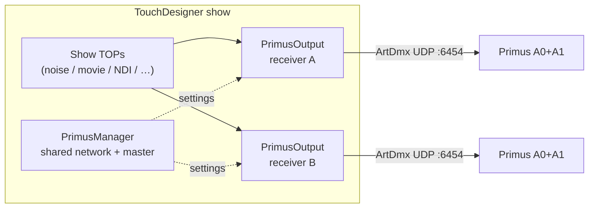
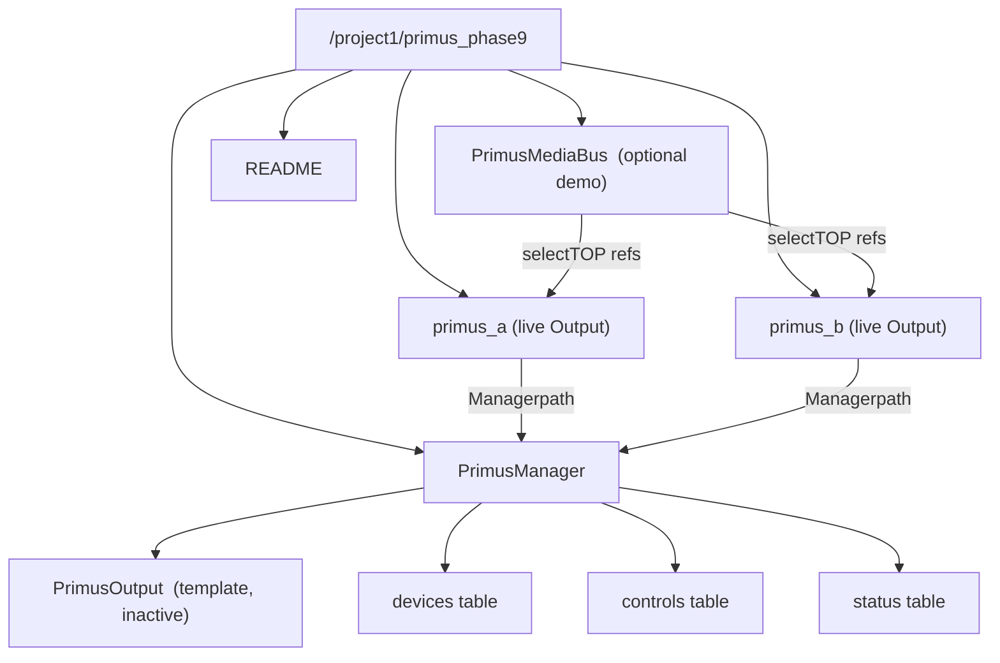
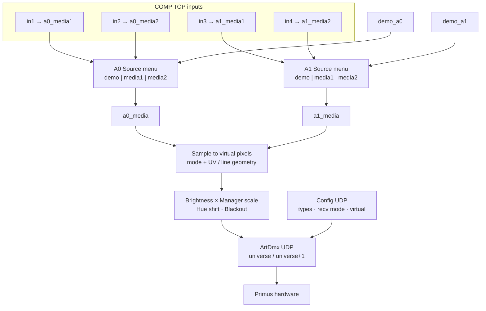
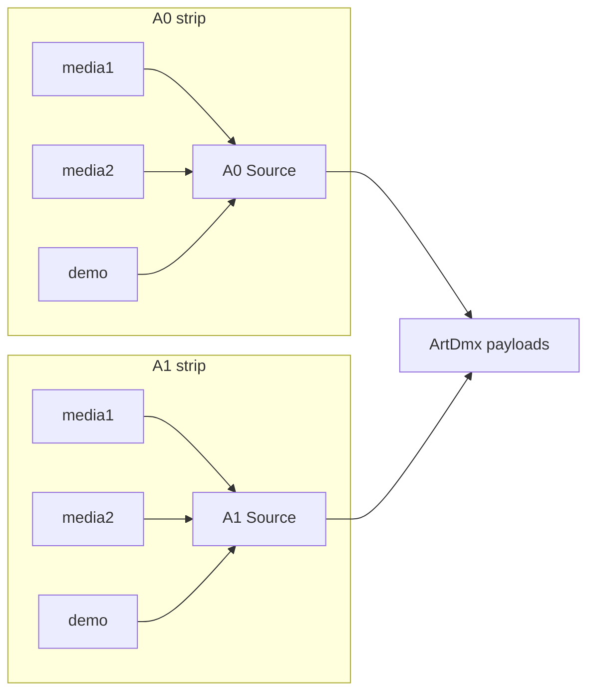
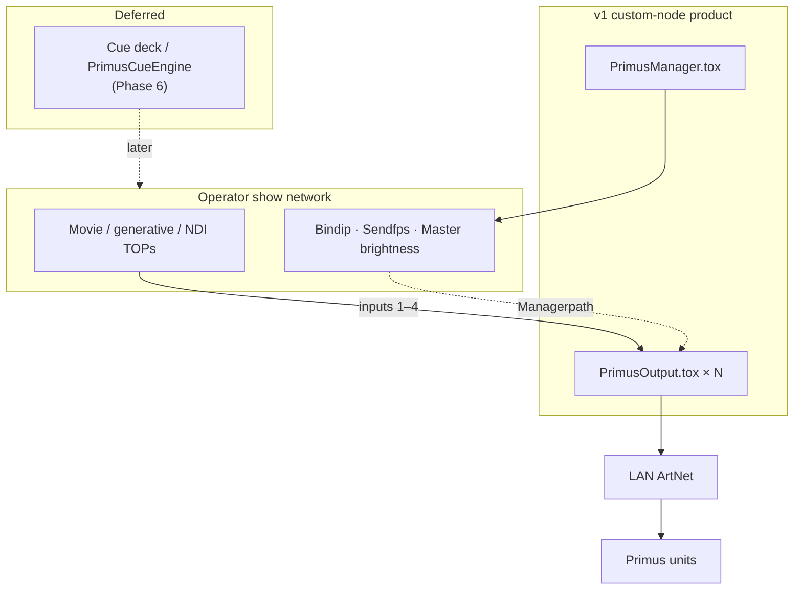
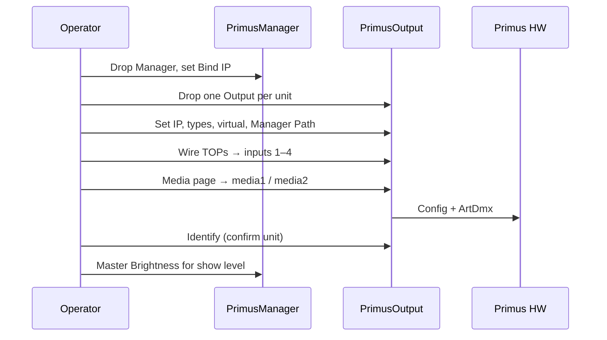

# Primus System Map (pre–custom-node)

Alignment document for packaging Phase 9 into drop-in TouchDesigner components.

**Source of truth today:** `builders/phase9_components.py` + `builders/lib/primus_output_network.py`  
**Not in v1:** cue deck (Phase 6 stays separate)

---

## 1. What we’re building

Operators drop **one Manager** and **one Output per Primus receiver**, wire show TOPs into each Output’s strip inputs, and ArtDmx leaves the machine toward hardware.



**Rule of thumb**

| Piece | Count | Owns |
|-------|------:|------|
| `PrimusManager` | 1 per show (or per NIC group) | Bind IP, send FPS, master brightness, discovery |
| `PrimusOutput` | 1 per Primus receiver | Device identity, media for A0/A1, look, ArtDmx sender |
| `PrimusMediaBus` | optional demo helper | Four generators for Palette demos — **not** required in a show |

---

## 2. Project layout (Phase 9 workshop)

Live Outputs sit **beside** the Manager (visible siblings), not buried inside it. An inactive template lives on the Manager for Create Outputs / `.tox` export.



---

## 3. End-to-end signal path

One PrimusOutput cooks media → samples → dims → packets.



**Brightness stack:** `Output.Brightness × Manager.Brightness` (both 0–1). Either blackout (local or Master) forces gain to 0.

---

## 4. Key nodes

### 4.1 PrimusManager

**Role:** Shared network / master / discovery. Does **not** send ArtDmx itself.

**Network I/O**

| Direction | What |
|-----------|------|
| In | Operator parameters; ArtPoll replies on Rescan |
| Out | Soft references via each Output’s `Managerpath` (bind IP, send FPS, brightness scale, blackout_all) |
| Side | Spawns sibling `PrimusOutput` COMPs from `devices` table |

#### Custom parameter pages (UI)

| Page | Parameter | Type | Purpose |
|------|-----------|------|---------|
| **Network** | Bind IP | string | Local NIC to bind UDP (`192.168.8.199` workshop default) |
| | Send FPS | float 1–60 | Cap ArtDmx rate for all Outputs |
| | Status | string | Last status line (read-ish) |
| **Master** | Brightness Scale | float 0–1 | Multiplier on every Output’s local brightness |
| | Blackout All | pulse | Force all Outputs dark |
| **Discovery** | Rescan Network | pulse | ArtPoll → fill `devices` |
| | Create / Sync Outputs | pulse | Add missing Outputs + update Device pars; **never destroys** |

#### Internal tables (power-user / debug)

| DAT | Role |
|-----|------|
| `devices` | One row per receiver (name, ip, types, virtual, active, …) |
| `controls` | Internal flags (`blackout_all`, rescan request, …) |
| `status` | Discovery state / counts |

#### Extension API (`PrimusManagerExt`)

- `Rescan()` / `CreateOutputs()` / `BlackoutAll(on=True)`

#### Operator UX

1. Set **Bind IP** to the wired NIC that can reach Primus.
2. Keep **Send FPS** at 30 unless the LAN is stressed.
3. Use **Brightness Scale** as the show-wide dimmer; leave per-Output brightness for relative balance.
4. **Rescan** when hardware appears/disappears; **Create / Sync Outputs** to add missing units or refresh Device params without wiping wiring.

---

### 4.2 PrimusOutput

**Role:** One COMP = one Primus receiver (physical A0 + A1). Owns media, look, config, and the UDP sender.

**Network I/O**

| Direction | What |
|-----------|------|
| TOP In | 4 COMP inputs (see media contract) |
| Param In | Device / Media / Look / Actions pages; optional Manager override |
| Out | ArtDmx (+ config packets) to `Ip:6454` |
| Status | `link` table (`state`, `sends`, `media`, errors) |

#### Media contract (TOP inputs)

Each strip has **its own** media slots — not a shared pool across A0/A1.

| COMP input | Internal null | Belongs to |
|-----------:|---------------|------------|
| 1 | `a0_media1` | A0 |
| 2 | `a0_media2` | A0 |
| 3 | `a1_media1` | A1 |
| 4 | `a1_media2` | A1 |

**Media page menus** (per strip): `demo` | `media1` | `media2`

- `demo` → animated fallback gradient for that strip  
- empty / unwired slot still falls back to demo when selected  



#### Custom parameter pages (UI)

**Device**

| Parameter | Type | Notes |
|-----------|------|-------|
| Active | toggle | Mute sender when off |
| IP | string | Primus host |
| Device Name | string | Label / COMP naming hint |
| Universe | int | Base universe (split: A1 uses +1) |
| Receive Mode | menu | `split` \| `combined` |
| A0 Type / A1 Type | menu | `none`, `short_strip`, `long_strip`, `grid`, `small_grid`, `extra_long_strip` |
| A0 Virtual Px / A1 Virtual Px | int | Clamped to type max; combined mode total ≤ 170 |
| Manager Path | string | Path to PrimusManager |
| Bind IP Override | string | Empty = use Manager Bind IP |

**Media**

| Parameter | Type | Notes |
|-----------|------|-------|
| A0 Source | menu | `demo` \| `media1` \| `media2` |
| A1 Source | menu | `demo` \| `media1` \| `media2` |

**Look**

| Parameter | Type | Notes |
|-----------|------|-------|
| Brightness | float 0–1 | Local; multiplied by Manager scale |
| Hue Shift | float 0–1 | Channel-rotate style shift |
| Blackout | toggle | Local mute |
| A0 Sample Mode / A1 Sample Mode | menu | `fit`, `roi_fit`, `hline`, `vline`, `line`, `point` |
| A0 U / A0 V | float 0–1 | Point / sample anchor |
| A1 U / A1 V / A1 U1 / A1 V1 | float 0–1 | Line endpoints for strip sampling |

**Actions**

| Parameter | Type | Notes |
|-----------|------|-------|
| Push Config | pulse | Force type / recv / virtual re-send |
| Identify (white) | pulse | Brief solid-white ArtDmx flash |

#### Internal tables

| DAT | Role |
|-----|------|
| `profile` | Mirrored device identity (ip, types, virtual, …) |
| `sampling` | Look + media slot keys used by the cook |
| `link` | Live status: `ok` / bind / send errors, `sends`, media labels |

#### Extension API (`PrimusOutputExt`)

- `Blackout(on=True)` / `PushConfig()` / `Identify(seconds=2.0)`

#### Operator UX

1. Select the Output COMP → **Device**: set IP, types, virtual, recv mode, Manager Path.
2. Wire show TOPs into inputs 1–4 (or dive and wire the `a0_media*` / `a1_media*` nulls).
3. **Media**: pick which slot each strip samples.
4. **Look**: balance brightness / sampling geometry; keep workshop level low (~0.1) until trusted.
5. Watch `link.state` → `ok` and climbing `sends`; use **Identify** to confirm which physical unit you’re talking to.
6. Prefer **Manager Brightness Scale** for show-wide fades; use local Brightness for per-unit balance.

---

### 4.3 PrimusMediaBus (optional)

**Role:** Four generative TOPs for demos / Palette smoke tests. Shipped as `PrimusMediaBus.tox`; not required for shows.

| Out | Generator | Typical Output slot |
|-----|-----------|---------------------|
| out1 | noise | `a0_media1` |
| out2 | gradient | `a0_media2` |
| out3 | solid wash | `a1_media1` |
| out4 | alt gradient | `a1_media2` |

Show content should wire **directly into PrimusOutput inputs**.

---

## 5. How pieces fit (show vs workshop)



Empty `Managerpath` auto-finds a sibling/parent `PrimusManager` and writes the path back.

---

## 6. Typical operator workflows

### Fresh show



### Two units, independent looks

- `primus_a` and `primus_b` each own their four media inputs.
- Same TOP can feed both if wired twice; they do not share a global media1–4 pool.
- Different A0/A1 sources, hue, and sample geometry per COMP = no cross-talk by design.

### Recovery

- Host down → Output backs off reconnects; `link` shows error; Textport rate-limited.
- Host returns → `recovered → IP`; sends resume.
- After type/virtual changes → **Push Config** (or wait for periodic refresh).

---

## 7. Packaging targets (next step after alignment)

| Deliverable | Contents | Operator drops |
|-------------|----------|----------------|
| `PrimusManager.tox` | Network / Master / Discovery pages + Ext | Once |
| `PrimusOutput.tox` | Device / Media / Look / Actions + viewer panel + Ext | Once per receiver |
| `PrimusMediaBus.tox` | Optional demo generators | Optional |
| Docs | This map + [`tox/README.md`](../tox/README.md) | — |

**Explicitly out of v1:** cue list, timeline, fixture-group abstractions, required MediaBus.

---

## 8. Locked packaging decisions (v1)

1. **Media slots per strip:** 2 (`media1` / `media2`).
2. **Output layout:** siblings of Manager (not nested children).
3. **Create / Sync Outputs:** add-missing + Device param update; never destroy.
4. **Recv mode:** `split` / `combined` exposed; default `split`; combined ≤170 enforced.
5. **UI:** custom parameter pages + compact viewer panel (`ui`).
6. **PrimusMediaBus:** optional third `.tox`.
7. **Managerpath:** explicit preferred; empty → auto-find sibling/parent Manager.

---

## 9. Quick reference card

```text
PrimusManager
  Network:  Bindip · Sendfps · Status
  Master:   Brightness · Blackout All
  Discovery: Rescan · Create / Sync Outputs

PrimusOutput  (× receivers)
  TOP in1–2 → A0 media1/2
  TOP in3–4 → A1 media1/2
  Device:   Active · IP · Universe · Recv · Types · Virtual · Managerpath
  Media:    A0 Source · A1 Source   (demo|media1|media2)
  Look:     Brightness · Hue · Blackout · Sample modes · UV
  Actions:  Push Config · Identify
  ui:       A0/A1 source + send viewers, link status
  Out:      ArtDmx → Ip:6454

PrimusMediaBus (optional)
  out1..out4 → demo generators
```
